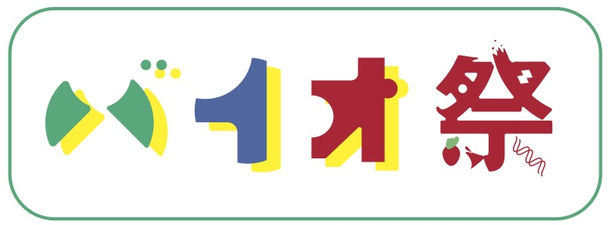

# バイア祭り 2021

::: tip ワークショップの準備
[ワークショップ開催前に](/preparation/)、準備作業を行ってください。
:::

## 時?
このワークショップは、2021年8月20日（金）13:00～15:00にZoomを使ってオンラインで行われます。

## 何が?
バイア祭りは、生物学のトピックやテクニックに親しみ、興味を持ってもらうためにデザインされた、自由に参加できるDIY生物学ワークショップのシリーズです。

今年のワークショップでは、私たちが行います。:
- イチゴからのDNA抽出
- 人工細胞の作成
- 純粋なバクテリアと混合バクテリアの培養
- フォールドスコープで顕微鏡を学ぶ

---

バイア祭りは、その一環として開催されます。[Kids Workshop 2021](https://www.roppongihills.com/en/sp/workshop/2021/).

