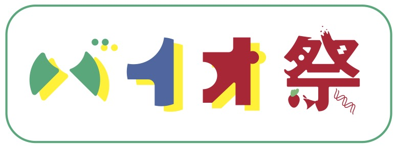
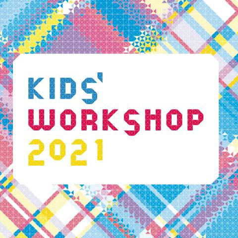

# BioMatsuri 2021

::: tip PREPARE FOR THE WORKSHOP
Please complete the [preparation tasks](/en/preparation/) BEFORE the workshop.
:::

## When?
The workshop will be conducted online, on Friday, August 20th 2021, 13:00 - 15:00 via Zoom.

## What?
BioMatsuri is a Series of open-ended DIY Biology Workshops designed to familiarize and engage with biological topics and techniques.

For this year's workshop we will do:
- DNA Extraction from Strawberries
- Creating Artificial Cells
- Growing Pure and Mixed Bacteria Cultures
- Learning Microscopy with Foldscope

---

BioMatsuri 2021 is organized as part of the [Kids Workshop 2021](https://www.roppongihills.com/en/sp/workshop/2021/).

